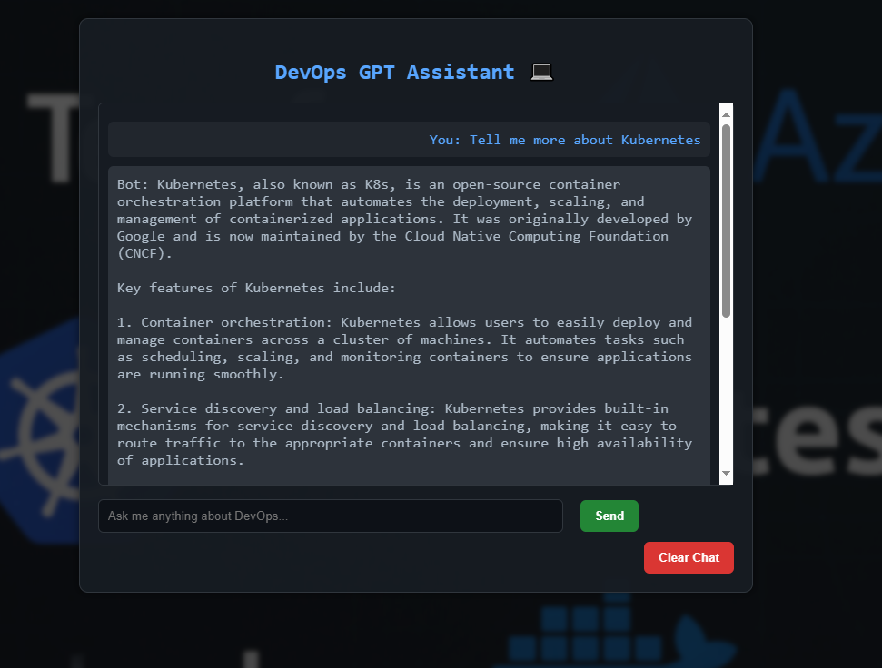
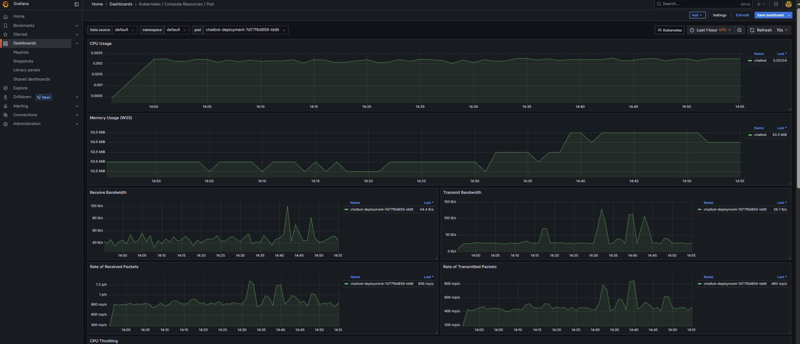
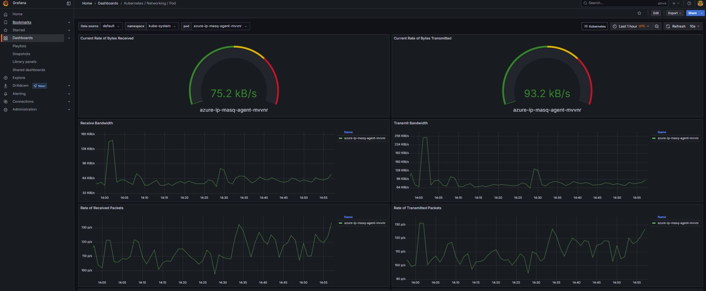

# 🤖 AI Chatbot - DevOps Deployment on Azure

This is a **production-ready, cloud-native AI chatbot** deployed on Microsoft Azure using a full DevOps pipeline. It’s modular, scalable, and mirrors real-world enterprise cloud deployment practices using Terraform, Docker, Kubernetes (AKS), GitHub Actions, and Azure-native services.  
➡️ Now includes **monitoring with Prometheus + Grafana** for real-time observability.

---

## ✅ What’s Working

- 🚀 FastAPI-based chatbot with OpenAI GPT integration
- 🐳 Dockerised and pushed to Azure Container Registry (ACR)
- ☸️ Deployed to AKS using Kubernetes manifests
- 📦 Modular Infrastructure-as-Code (Terraform modules)
- ⚙️ CI/CD with GitHub Actions (build → push → deploy)
- 🎨 Custom front-end with DevOps-themed background
- 📈 **Monitoring dashboards** powered by Grafana & Prometheus
- 📸 Visual chatbot demonstration below

---

## 📸 AI Chatbot in Action



---

## 🧠 Why This Project Matters

This project is perfect for DevOps engineers or learners who want to **build and deploy something real** instead of only watching tutorials. It teaches:

- Modular Terraform best practices
- Container orchestration with Kubernetes
- AKS, ACR, LoadBalancers, and resource networking on Azure
- End-to-end DevOps automation
- **Production-grade observability**

---

## 📈 Monitoring Stack (Prometheus + Grafana)

We used `kube-prometheus-stack` to deploy monitoring tools via Helm charts. This stack captures metrics for:

- CPU & Memory usage
- Pod networking (bandwidth, packets, errors)
- Cluster health

> Dashboards are auto-deployed with useful Kubernetes templates.

### 📊 Resource Usage



### 🌐 Network Traffic



---

## 📁 Folder Structure

```
AI-Chatbot/
├── app/                    # FastAPI chatbot app
│   ├── main.py
│   ├── Dockerfile
│   └── requirements.txt
│
├── static/                 # Front-end assets
│   └── index.html
│
├── k8s/                    # Kubernetes configs
│   ├── deployment.yaml
│   └── service.yaml
│
├── terraform/
│   ├── modules/            # Reusable Terraform modules
│   │   ├── aks/
│   │   ├── acr/
│   │   └── network/
│   └── environments/
│       └── dev/
│           ├── main.tf
│           ├── variables.tf
│           ├── terraform.tfvars
│           ├── outputs.tf
│           └── backend.tf
│
├── monitoring/             # Monitoring stack via Helm
│   ├── prometheus-values.yaml
│   └── grafana-values.yaml
│
├── assets/                 # Images and diagrams
│   └── chat-ui.jpeg
│
├── .github/                # GitHub Actions workflows
│   └── workflows/
│       └── ci-cd.yml
│
└── README.md
```

---

## 📦 Tech Stack

| Layer          | Tool                     |
| -------------- | ------------------------ |
| IaC            | Terraform                |
| Cloud Provider | Microsoft Azure          |
| Container      | Docker                   |
| Orchestration  | Kubernetes (AKS)         |
| Registry       | Azure Container Registry |
| App Framework  | FastAPI (Python)         |
| CI/CD          | GitHub Actions           |
| Monitoring     | Prometheus + Grafana     |

---

## 🧠 Why This Project Matters

This project is perfect for DevOps engineers or learners who want to **build and deploy something real** instead of only watching tutorials. It teaches:

- Modular Terraform best practices
- Container orchestration with Kubernetes
- AKS, ACR, LoadBalancers, and resource networking on Azure
- End-to-end DevOps automation
- **Production-grade observability**

---

## ⚙️ Instructions to Deploy Locally or on Your Own Azure Account

### Prerequisites:

- Azure CLI configured with your subscription
- Terraform installed (`>=1.3.0`)
- Docker Desktop installed
- Kubernetes CLI (`kubectl`) installed
- Python 3.10+

### 1. Clone the Repo

```bash
git clone https://github.com/ZakariaYusuf11/AI-Chatbot.git
cd AI-Chatbot
```

### 2. Configure Terraform

Go to `terraform/environments/dev/terraform.tfvars` and **replace placeholder values** with your own Azure setup:

```hcl
project_name        = "chatbot"
resource_group_name = "chatbot-cloudcity-rg"
location            = "UK South"
acr_name            = "youracrname"
aks_name            = "chatbot-aks"
vnet_name           = "chatbot-vnet"
subnet_name         = "chatbot-subnet"
```

> Ensure `acr_name` is globally unique!

### 3. Deploy Infrastructure

```bash
cd terraform/environments/dev
terraform init
terraform plan
terraform apply
```

### 4. Build & Push the Docker Image

```bash
cd ../../../app
az acr login --name YOUR_ACR_NAME
docker build -t YOUR_ACR_NAME.azurecr.io/chatbot-app:latest .
docker push YOUR_ACR_NAME.azurecr.io/chatbot-app:latest
```

### 5. Deploy to AKS

```bash
kubectl apply -f ../k8s/deployment.yaml
kubectl apply -f ../k8s/service.yaml
```

---

## 🔐 Secure OpenAI Key Setup (Kubernetes Secrets)

To integrate GPT securely:

### Step 1: Create the Kubernetes Secret

```bash
kubectl create secret generic openai-secret \
  --from-literal=OPENAI_API_KEY=sk-xxxxxxx
```

### Step 2: Reference the secret in your deployment.yaml

```yaml
env:
  - name: OPENAI_API_KEY
    valueFrom:
      secretKeyRef:
        name: openai-secret
        key: OPENAI_API_KEY
```

### Step 3: Python uses the variable like this

```python
client = openai.OpenAI(api_key=os.getenv("OPENAI_API_KEY"))
```

> 🔐 Do **not** commit your `.env` file or hardcoded secrets.

---

## 👨‍💻 Author

Built with ☁️ love and container-powered robots by [Zakaria Yusuf](https://github.com/ZakariaYusuf11)  
📍 London | 🚀 DevOps | 🤖 AI + Cloud Enthusiast  
🔗 LinkedIn: [www.linkedin.com/in/zakaria-yusuf-a6a365230](www.linkedin.com/in/zakaria-yusuf-a6a365230)

---

> ⭐ Star this repo if you found it useful!
